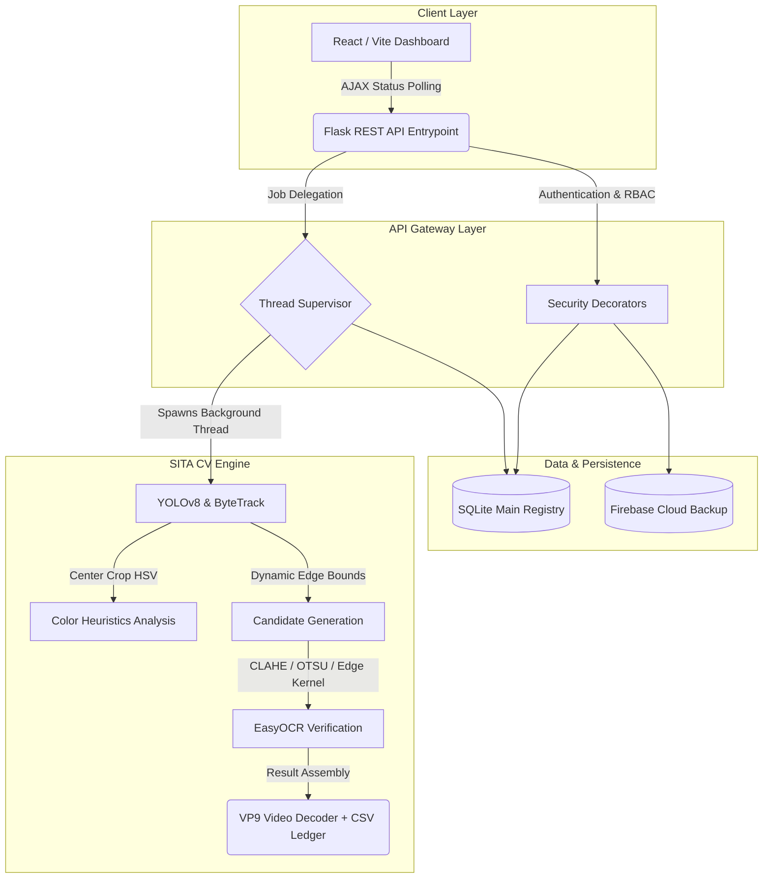
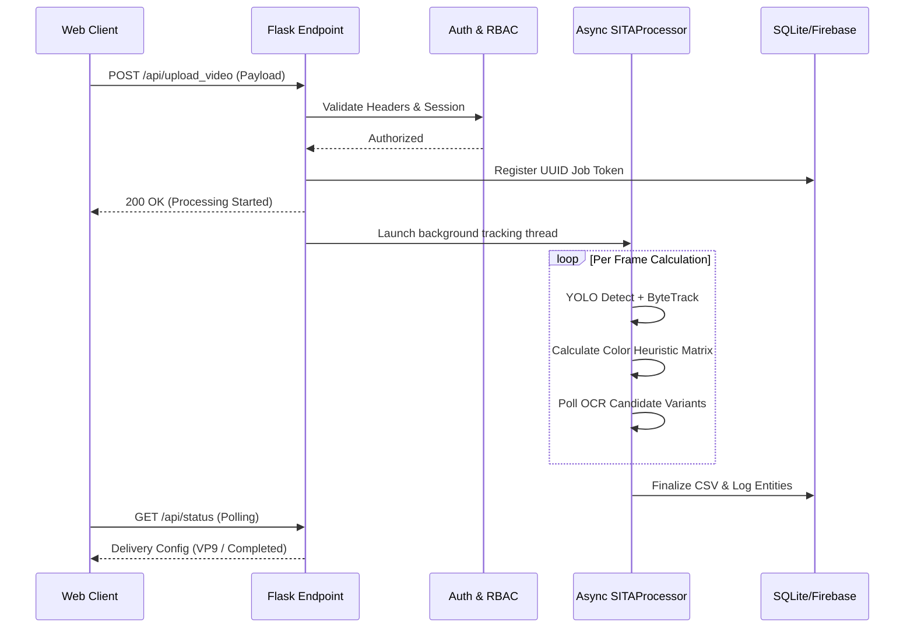
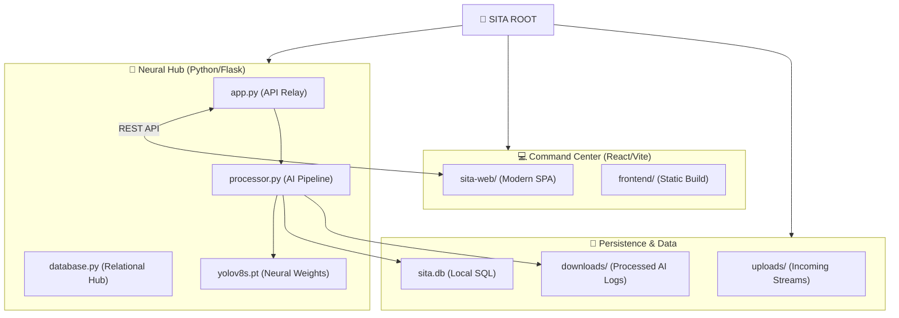
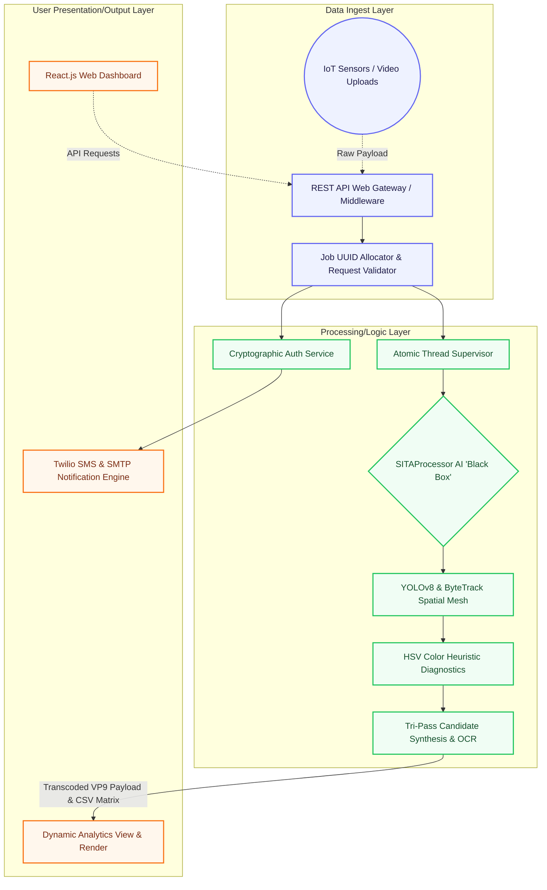

# SITA Intelligence Core

## Executive Summary
The **SITA (Secure Intelligent Traffic Analysis) Core** represents a state-of-the-art, high-fidelity AI surveillance framework explicitly engineered to autonomously ingest, process, and analyze heterogeneous video streams. Serving as an enterprise-grade intelligence platform, SITA offers hyper-accurate vehicle classification, localized color extraction heuristics, and temporally-validated Automatic License Plate Recognition (ALPR). Conceived with advanced system concurrency, granular Role-Based Access Control (RBAC), and low-latency architectural patterns, SITA delivers actionable temporal data vital for security auditing and traffic management while ensuring uncompromised scalability and cryptographic security.

## Tech Stack
**Frontend Ecosystem:**
- **Core Framework:** React.js 19, Vite
- **Styling & UI:** Tailwind CSS, Framer Motion (for dynamic state transitions), Lucide React
- **Authentication:** Google OAuth2 (`@react-oauth/google`)

**Backend API & Services:**
- **Web Gateway:** Python 3.x, Flask, Flask-CORS
- **Server Execution:** Gunicorn, Asynchronous Threading (`threading.Thread`)
- **Security Primitives:** Werkzeug Security (Cryptographic Hashing), Twilio Verify API (SMS OTP), SMTP Gateway (Secure Email Tunnels)

**Database & Persistence Layer:**
- **Primary Relational Store:** SQLite (Atomic transactional data tracking, Job States, and RBAC policies)
- **Cloud Telemetry/Sync:** Firebase (`firebase_utils` for distributed log syncing and profile management)

**AI/ML & Computer Vision Engine:**
- **Primary Object Detection:** Ultralytics YOLOv8s (with ByteTrack spatial-temporal pairing)
- **Vision Pipeline:** OpenCV (`cv2`) for HSV color isolation, Region-of-Interest (ROI) padding, Kernel Edge Enhancement, and CLAHE
- **Optical Character Recognition:** EasyOCR (PyTorch), utilizing dynamic candidate allowance matrices and GPU acceleration

## System Architecture
SITA operates on a **Decoupled Asynchronous Micro-Monolith** paradigm. This architectural configuration bifurcates rapid I/O operations from computationally intensive AI inference tasks. A RESTful Flask gateway securely validates external requests against multi-tiered RBAC protocols (Super Admin, Sector Admin, User) using AES-compliant encryption and distributed hash tables. Once authenticated and ingested, resource-heavy operations are handed over to isolated background threads governed by mutex locks (`job_lock`). This guarantees an unbounded, highly scalable dashboard responsive to continuous polling. System state is dual-persisted locally through strict SQLite operations and remotely synchronized via Firebase, establishing a highly redundant, crash-resistant operational fault tolerance.

## Workflow Logic
1. **Secure Ingestion & Validation**
   Surveillance payloads are transmitted to `/api/upload_video`. The gateway validates the User/Admin security role using `X-User-Email` and session authorization vectors, rejecting unauthorized endpoints.
2. **Asynchronous Thread Allocation**
   A globally tracking mutex registers a new execution context mapping to a UUID. The API responds instantly, freeing network I/O while dedicating an internal unblocked thread to initiate the `SITAProcessor`.
3. **Primary Detection & ByteTracking**
   Video inputs undergo frame-by-frame analysis via YOLOv8. Entities (Cars, Trucks, Bikes) are detected and fed into ByteTrack logic. This establishes chronological object persistence, issuing unique Track IDs and shielding against intermittent frame occlusions.
4. **HSV Thresholding & Heuristic Color Logging**
   Once a tracked entity survives a 5-frame persistence "lock", the framework computes an intelligent geometric center-crop (20% inwards from edges) and parses the resultant RGB matrix into the HSV spatial spectrum. Algorithmic loops assess area densities against specified tolerances (e.g., White, Black, Red, Blue) to classify vehicle color.
5. **Multi-Pass OCR Candidate Polling**
   A separate bounding sequence targets the lower quadrant of the vehicle. The cropped License Plate region undergoes geometric padding and Tri-Pass Image enhancement (Grayscale with Edge-Sharpening Kernel, OTSU Binarization, and CLAHE normalization). The OCR engine tests candidates against an alphanumeric whitelist. SITA continues polling for 10 frames on the same tracked entity, retaining only the "Best Confidence" result.
6. **Telemetry Export**
   Statistical aggregations are merged into an analytic `.csv` ledger. A transcoded VP9 (WebM) video payload featuring drawn bounding boxes and plate mappings is served back asynchronously, updating locally maintained `sqlite3` records and triggering UI dashboards through iterative AJAX polling.

## Block Diagram Logic

### System Component Architecture


### Execution Sequence Diagram


## Unique Innovation
### The "Inventive Step"
The critical innovation inside the SITA engine centers on **Temporal Decoupling of Spatial Localization from Character Extraction**. 
Unlike legacy systems that greedily execute OCR on static frames or single-pass intercepts (often yielding heavy false-negatives due to motion blur, angular distortion, or momentary occlusion), SITA decouples the process temporarily. 
SITA defers character recognition until a non-broken bounding-box timeline has been securely locked using ByteTrack persistence spanning a 5-frame minimum. Once stabilized, the pipeline utilizes a **"Rolling Candidate Regression"**—it generates three separate computational candidates per frame (Edge-Kernel Sharpened, OTSU Threshold, and CLAHE enhanced) and checks them against strict alpha-numeric parameters over subsequent chronological tracking cycles. Because the model iteratively updates a confidence register tied to the persistent entity (and penalizes anomalous brief misreads), SITA fundamentally eliminates performance waste on erroneous frames, achieving maximum plate reliability with remarkably reduced parallel computational strain.

---

## 📁 Project Structure

To maintain the SITA system, it is essential to understand the organizational layout of the repository.

### **Visual Architecture Map**


### **Directory Hierarchy**
```text
SITA/
├── app.py              "Backend API Layer"
├── processor.py        "AI Neural Pipeline"
├── database.py         "Relational Data Hub"
├── firebase_utils.py   "Cloud Logic Sync"
├── yolov8s.pt          "Neural Model Weights"
├── .env                "System Credentials"
├── requirements.txt    "Python Dependencies"
├── sita.db             "Production Database"
├── sita-web/           "Modern React Frontend"
│   ├── package.json    "npm Manifest"
│   ├── vite.config.js  "Vite Build Config"
│   └── src/
│       ├── components/ "Reusable UI Parts"
│       ├── pages/      "Application Views"
│       └── App.jsx     "Routing & Layout"
├── uploads/            "Incoming Video Data"
├── downloads/          "Processed AI Reports"
├── frontend/           "Legacy/Static Assets"
└── backend/            "Placeholder Context"
```

### **Complete Project Tree**
Below is the exhaustive listing of all files and folders in the SITA repository, excluding environment-specific items like `.venv` and `node_modules`.

```text
SITA/
├── 📄 .env                    "Private system credentials & API keys"
├── 📄 .env.example            "Template for environment configuration"
├── 📄 .gitignore              "Git exclusion registry"
├── 📄 app.py                  "Main Flask Backend Server and API Relay"
├── 📄 processor.py            "Core AI Pipeline (YOLOv8 + ByteTrack + EasyOCR)"
├── 📄 database.py             "SQLite Hub; handles RBAC, Jobs, and Sectors"
├── 📄 firebase_utils.py       "Utility layer for cloud-based audit logging"
├── 📄 requirements.txt        "Backend Python dependency manifest"
├── 📄 yolov8s.pt              "Pre-trained neural weights for AI detection"
├── 📄 sita.db                 "Production relational database file"
├── 📄 README.md               "Main system documentation"
├── 📄 DEPLOYMENT_GUIDE.md     "Cloud production deployment manual"
├── 📄 PROJECT_STRUCTURE_ANALYSIS.md "Technical structural breakdown"
├── 📄 PATENT_DISCLOSURE.md    "Technical logic and Inventive Step disclosure"
├── 📄 Dockerfile              "Docker containerization instructions"
├── 📄 Procfile                "Deployment command for cloud platforms"
├── 📄 render.yaml             "Infrastructure-as-code for Render.com"
├── 📄 netlify.toml            "Frontend config for Netlify deployment"
├── 📄 reset_passwords.py      "Emergency credential recovery script"
├── 📄 check_admins.py         "Admin role verification utility"
├── 📄 clean_admin.py          "Security cleanup script for roles"
├── 📄 firebase_utils.py       "Firebase synchronization handler"
├── 📄 get_credentials.py      "Automated credential extraction logic"
├── 📄 idreadme.md             "Identity identification documentation"
├── 📁 sita-web/               "Modern React/Vite Frontend Repository"
│   ├── 📄 package.json        "npm dependency registry & build scripts"
│   ├── 📄 vite.config.js      "HMR and build tool configuration"
│   ├── 📄 tailwind.config.js  "Custom UI design system configuration"
│   ├── 📄 index.html          "Single Page Application entry point"
│   ├── 📁 src/                "Source code for the Command Center"
│   │   ├── 📄 App.jsx         "Main routing engine and global layout"
│   │   ├── 📄 main.jsx        "React DOM mount point"
│   │   ├── 📄 index.css       "Global styles and tailwind directives"
│   │   ├── 📁 pages/          "Application logical views"
│   │   │   ├── 📄 AccessGate.jsx     "Authentication gateway"
│   │   │   ├── 📄 Experience.jsx     "Main AI Video Analytics Interface"
│   │   │   ├── 📄 AdminDashboard.jsx "Organization management dashboard"
│   │   │   ├── 📄 UserDashboard.jsx  "Agent-level data visualization"
│   │   │   └── 📄 Verification.jsx   "MFA and OTP verification screen"
│   │   ├── 📁 components/     "Modular UI components"
│   │   │   ├── 📁 layout/     "Sidebar, Navbar, and Protectors"
│   │   │   ├── 📁 ui/         "Generic components (Buttons, Panels)"
│   │   │   ├── 📄 Hero3D.jsx  "Main 3D motion-reactive hero"
│   │   │   └── 📄 StarField.jsx"Dynamic backdrop particle system"
│   │   ├── 📁 context/        "State management providers (Auth/Toasts)"
│   │   ├── 📁 hooks/          "Custom logic hooks (Sounds, API Handlers)"
│   │   ├── 📁 lib/            "Helper libraries (API, Utils)"
│   │   └── 📁 data/           "Static reference JSON/JS datasets"
│   ├── 📁 public/             "Static public assets (Logos, Icons)"
│   └── 📄 vercel.json         "Vite deployment instructions for Vercel"
├── 📁 uploads/                "Storage for raw video input payloads"
├── 📁 downloads/              "Output storage for CSVs and processed WebMs"
├── 📁 frontend/               "Static build output / Legacy assets"
├── 📁 backend/                "Migration placeholder directory"
├── 📄 day[1-6] scripts        "Development cycle research & test scripts"
├── 📄 verify_* scripts        "Component-level verification protocols"
├── 📄 test_* scripts          "Unit testing suite (OTP, OCR, Codecs)"
├── 📄 reproduce_* scripts     "Debug environments for issue isolation"
└── 📄 server.log              "Real-time system transaction logs"
```

---

## Technical Visualization & Architectural Mapping

### Task 1: Functional Block Diagram


### Task 2: Logical System Architecture

**Architectural Style:** 
The SITA Intelligence Core is built upon a **Decoupled Asynchronous Micro-Monolith** paradigm utilizing a strict **Client-Server Layered Architecture**. This model bifurcates high-velocity HTTP API I/O bound states from unblocked, heavy-compute deep inference AI models by leveraging asynchronous background thread allocation mapped seamlessly to a persistent atomic datastore, thereby preventing application stagnation and ensuring horizontal scalability natively.

**Categorized Security Protocols:**
- **In-flight Transport Security:** HTTPS/TLS configuration explicitly engineered for encrypted RESTful edge interactions.
- **Payload Verification:** JSON Web Tokens (JWT) and secure session headers supporting continuous uncompromised client-side API gateway polling.
- **Identity & Access Management (IAM):** Dual-channel Out-of-Band (OOB) authentication matrices verifying telemetry via SMTP Email Tunnels and Twilio API SMS loops.
- **Cryptographic Persistence:** Werkzeug AES-compliant cryptographic hashing operations applied systematically to all localized SQLite and synced Firebase security schemas.
- **Zero-Trust Segregation:** Highly-strict decorator-driven Role-Based Access Control (RBAC) guaranteeing computational segregation spanning Super Admin, Sector Admin, and standard Client instances.

**The "Black Box" Core Algorithm:**
The defining proprietary logic—representing the patent-eligible focal point distinguishing SITA from conventional ALPR environments—resides inside the *Temporal Verification and Tri-Pass Rolling Confidence Model*. Rather than defaulting to single-pass regional character intercepts, the isolated Black Box mechanism defers automated text extraction completely until a vehicle entity persistently stabilizes across five separate chronological geometry bounds utilizing ByteTrack logic matrices. Upon spatial "locking," the engine launches Candidate Synthesis: procedurally calculating overlapping parallel variations (CLAHE contrast normalizations, OTSU statistical binarization meshes, and a rigidly mapped `[[0,-1,0], [-1,5,-1], [0,-1,0]]` edge enhancement topological kernel). Character inference is exclusively executed against these optimized composite candidates rolling chronologically to penalize motion-blurred distortions, rendering unprecedented, deterministic ALPR confidence outputs unconstrained by localized single-frame blurring.

## Intellectual Property & Innovation

**The Inventive Step:**  
The foundational inventive step disclosed inherently by the SITA framework is the **Temporal Decoupling of Spatial Localization from the Character Extraction Matrix combined with Rolling Tri-Pass Regression.** 

While legacy academic and commercial computer-vision architectures natively trigger deep-inference operations synchronously upon bounding-box intersections, they introduce severe mathematical failure rates caused directly by localized variables such as kinetic speed-distortion, environmental noise occlusion, and angular photon reflection. SITA permanently circumvents this computational ceiling by abstracting the OCR matrix polling cycle. By leveraging programmatic delays until temporal sequences secure stable chronological continuity, and by manufacturing three distinctly formulated spatial variants (Edge-Kernel Sharpened, OTSU Threshold, and CLAHE enhanced) to be statistically cross-verified, the core software isolates, bounds, and exponentially penalizes OCR anomalies natively. This sophisticated multi-pass candidate synthesis process fundamentally terminates computational processing bottlenecks while enabling an asynchronous fault-tolerance output previously incompatible with edge-deployed artificial intelligence solutions.
